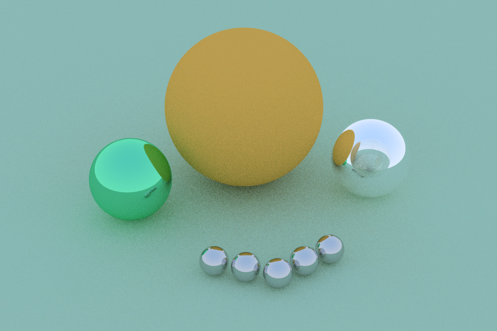

# RayTracing
This is a very basic raytracer and it is for learning purposes.
This project is still in progress.

### Threading to improve performance
Used this library to make a thread pool [CTPL](https://github.com/vit-vit/CTPL).

### Basic config? 
- Modify `samples_per_pixel` and `max_depth` with your prefered values, less values means better performance.
- Modify `image_width` and `aspect_ratio` with your prefered values.
- `num_of_threads` is the number of threads in the pool, choose a suitable number (Default: All available)
- `lines_per_thread` is the number of lines that each thread should handle (line is just a single row of pixels of the image width)

### How to use?
Compile using your favourite c++ compiler and if it has an option for an optimizer use it see [build.sh](build.sh). also notice that this would make your CPU an inefficient heater, Mine got to 95C. and if you didn't use the optimizer it would take ages to finish.
Redirect STDOUT to a file with .ppm extension then open it using an image viewer. it should look like this

Followed this guide
[_Ray Tracing in One Weekend_](https://raytracing.github.io/books/RayTracingInOneWeekend.html)
